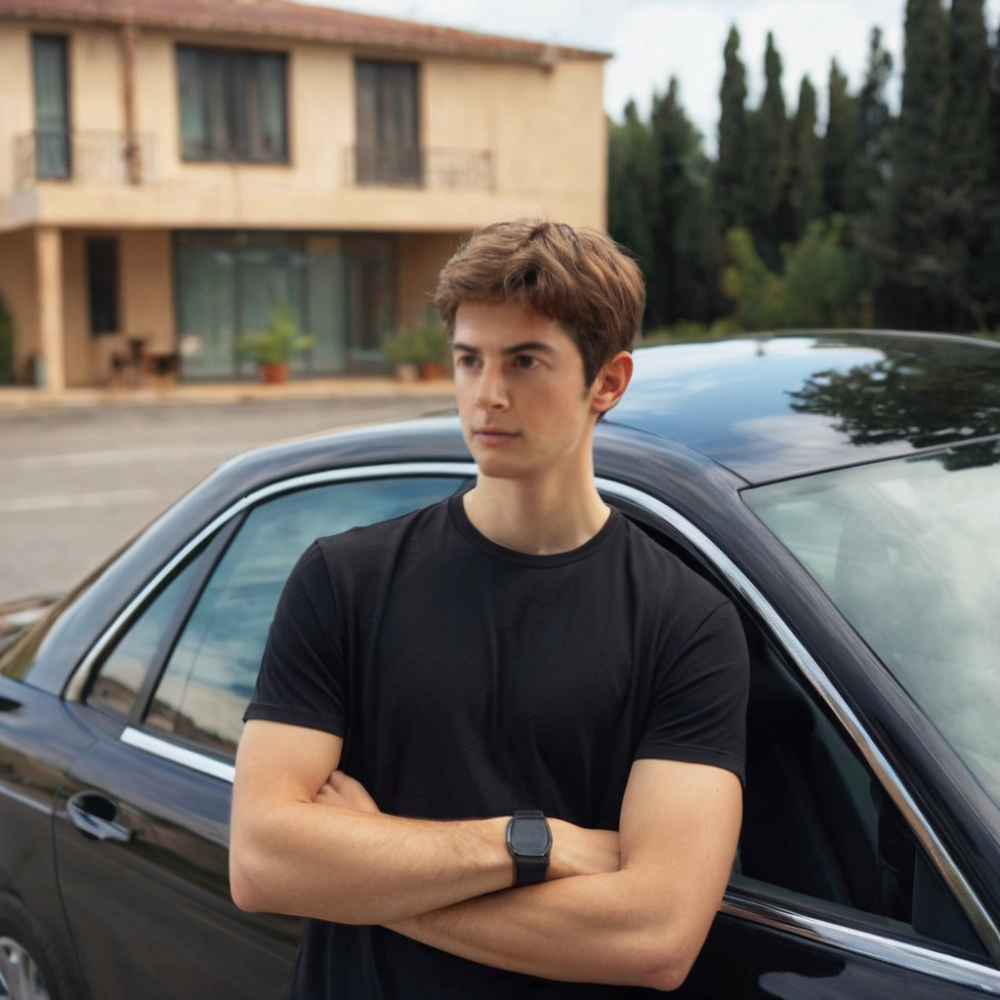
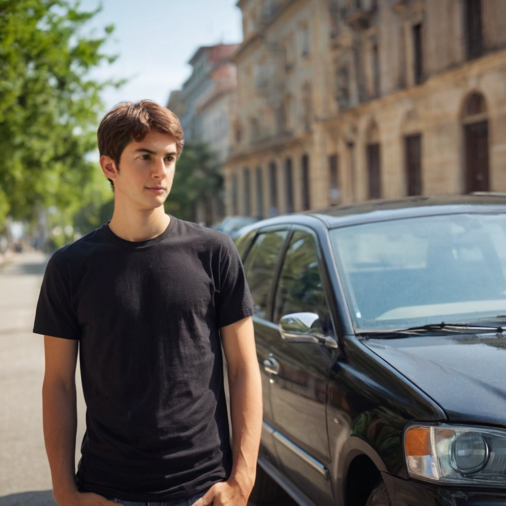
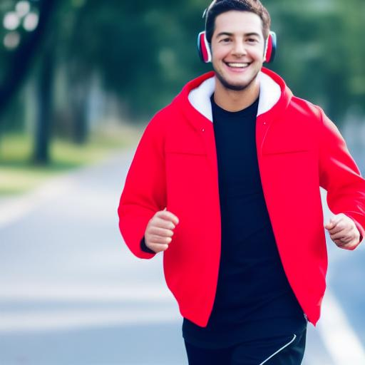
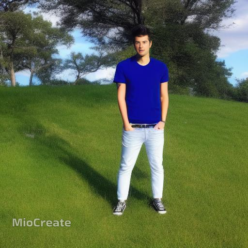
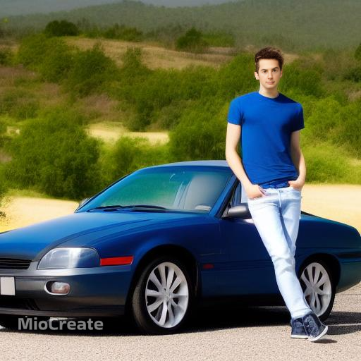
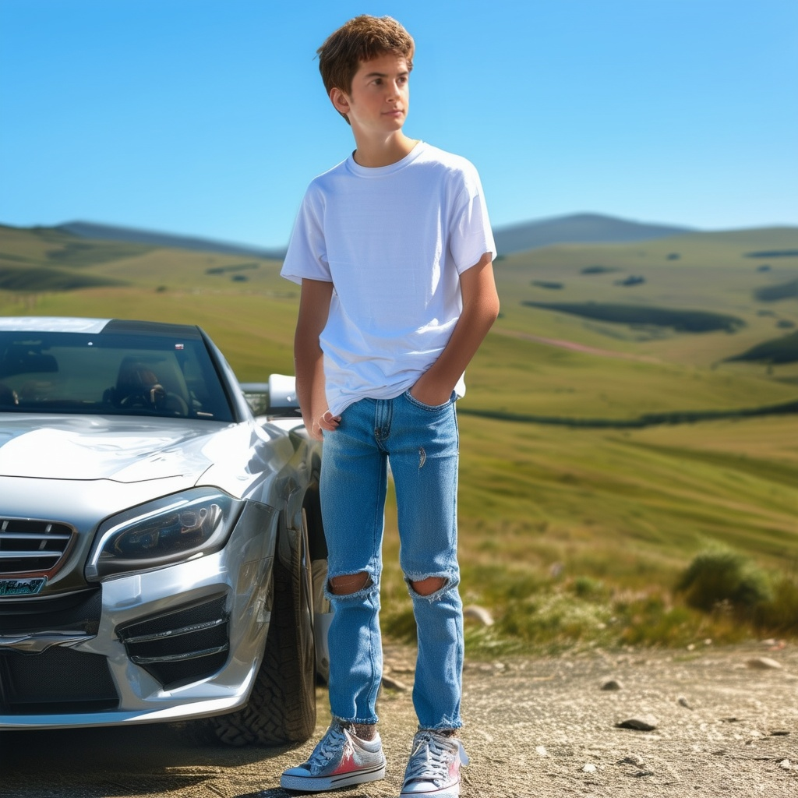

# AI Image Generation Workflow for Consistent, High-Quality AI Influencer Images

## Overview

This project aims to create a robust AI image generation workflow that can produce a large number of consistent, high-quality images of AI influencers maintaining character consistency across multiple settings and poses while producing a high volume of images efficiently is a significant hurdle.
This is just a testing project for just demonstrating potential functionalities.

## Key Features

- **Character Consistency**: The workflow can generate images of a single character, ensuring that the character's core features (face, body type, etc.) remain consistent across all generated images.
- **Multiple Character Support**: Users can specify the character at the first stage.
- **Image Quality**: I have chosen several scales for future possibilities. We can boost calculation by choosing low-resolution results and Upsampling those with light-weight
  SR models. It can also
- **Efficiency**: The workflow is working completely online, so no requirements of calculational resources.
- **Customization**: The workflow can be easily modified to create new characters or adjust existing ones.

## Getting Started

### Prerequisites

- Python 3.10 installed
- Required Python packages installed (see installation instructions)

### Installation

Install the required dependencies:

```
(optional) conda create -n my-env python==3.10.9
(optional) conda activate my-env
pip install -r requirements.txt
```

### Usage

1. Prepare your character prompts and target person's photo (e.g., reference images) required by the workflow.
2. Run the main scope script:
   ```
   python run.py
   ```
3. The generated images will be saved in the `/img/output` directory, organized by character.

## Challenges and Approach

During the development of this workflow, we faced several challenges, including:

1. **Maintaining Character Consistency**: Ensuring that the character's core features remained consistent across multiple generated images was a complex task. We explored various techniques, such as using reference images and fine-tuning the AI model, to achieve the desired level of consistency. Finally the most effective and satisfactory
   result was by combining text-to-image GANs and face swapping technologies. Simply combining two technologies with proper prompt preprocessing, we could get the
   great result with free api and no resources - great starting point.
2. **Generating Diverse Poses and Backgrounds**: By choosing random seed for image generation stage, we could generate many totall different images.

## Sample Outputs

Here are sample outputs demonstrating the workflow's capabilities:

### These are the results of fooocus with generation size of 1024

<p align="left">
  
  
  
</p>

### These are the results of huggingface/runwaymi with generation size of 512

<p align="left">
  
  
  
  
</p>

### These are of another character

<p align="left">
  
  
  
</p>

#### You can get the original images of first stage(image generation) and used target character from img/source

As long as this is an examinational project, we have plenty of more options for enriching and improving the overall quatility and reality of generation results.

## Conclusion

This AI image generation workflow provides a robust and efficient solution for creating consistent, high-quality images of AI influencers. By addressing the key challenges in AI-generated content, the workflow enables the production of a large number of images that maintain character consistency across diverse settings and poses.

###Future Enhancements
To further improve the capabilities of this workflow, the following enhancements can be considered:

1. **Expanded Character Customization**: Develop a more intuitive and user-friendly interface for modifying character prompts and input files, allowing for even greater customization and personalization of the generated images.

2. **Automated Prompt Optimization**: Implement machine learning-based techniques to automatically optimize prompts for improved character consistency and image quality, reducing the manual effort required for prompt engineering.

3. **Multi-Modal Integration**: Explore the integration of additional modalities, such as text-to-speech or audio-to-image generation, to create a more comprehensive AI influencer content creation suite.

4. **Real-Time Generation**: Investigate methods to enable real-time or near-real-time image generation, further streamlining the content creation process and allowing for more dynamic and responsive AI influencer campaigns.

5. **Deployment and Scaling**: Develop a scalable deployment solution, such as a cloud-based platform or a containerized application, to make the workflow accessible to a wider range of users and enable seamless integration with existing AI influencer workflows.
